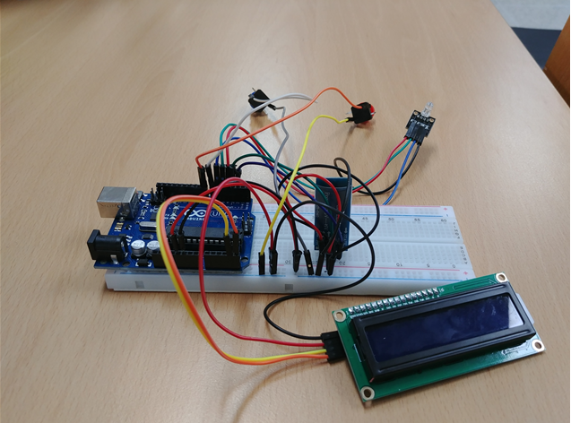
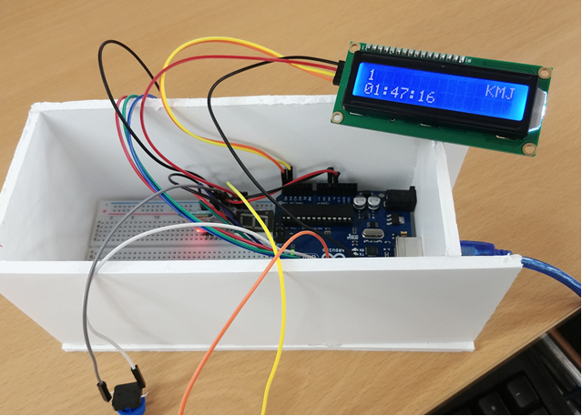

# 능률 팍팍! 공부 시계

### 제품 제작 목적 및 필요성

공부를 할 때 규칙적으로 학습 시간을 유지하는 것은 결코 쉬운 일이 아닙니다. 어떨 때는 의욕이 나지 않는다며 농땡이를 부리기도 하고, 스스로에게 핑계를 대며 지금 공부를 하지 않아도 될 합리적인 이유를 만들어 안심하기도 합니다. 이 제품은 자신의 시간을 좀 더 효율적으로 사용하면서 자신에게 공부할 의욕을 불어넣고 싶은 사람들을 위해서 만들어질 것입니다. 

이 시계는 공부한 기록들을 마치 게임 스코어처럼 기록하여, 다른 사람들이 공부한 시간과 지금 공부한 시간을 비교하여 자신이 공부해야할 목표치를 스스로 결정할 수 있게 합니다. 이와 같은 기능은 사용자에게 승부욕을 불러일으켜서 다른 사람의 기록보다 더 많은 시간을 공부하기 위해 더 열심히 노력하게 만들고, 자신이 만족할 기록을 새우면 성취감을 느끼게 만들어서 경쟁하는 것에 대한 재미를 느끼게 할 수 있습니다. 이는 공부하는 이유를 찾지 못하는 학생들이나 평소 게임을 좋아하는 학생들에게 공부에 흥미를 느끼게 만들 수 있을 것이고, 이미 열심히 공부하는 학생들에겐 서로 자신의 실력을 겨루며 재미를 느낄 수 있는 기회가 될 것입니다.

### 동작 및 기능 설명

이 시계는 총 두 가지의 모드가 존재하는 데, 첫 번째는 공부 시간을 카운트하기 위한 스톱워치 모드, 두 번째는 지금까지의 공부 기록을 확인 할 수 있는 스코어 모드입니다. 두 모드는 전용버튼을 이용해 전환이 가능하며, 스톱워치 모드에서는 아두이노에 블루투스를 연결하여 스마트폰을 통해 자신의 이름의 이니셜을 입력하고 버튼을 누르면 스톱워치가 시작되어 사용자가 공부를 끝내기까지 시간을 측정합니다. 버튼을 다시 누르게 되면 공부 시간을 저장하는 전용 서버에 데이터를 저장하게 되며 저장된 기록들은 스코어 모드에서 사용자별로 최고 기록을 나열해서 보여줄 것입니다. 위와 같은 기능을 사용하기 위해서 블루투스 직렬 포트 모듈 ‘HC-06’을 사용하여 블루투스 기능을 제공하고, 블루투스를 연결하는 스마트폰 측에서는 ‘Arduino bluetooth controller’라는 어플을 사용할 예정입니다. 또한, 공부 스코어를 보여주기 위해서 LCD 1602 with IIC 모듈을 사용해서 여러 명의 순위를 보여줄 수 있도록 페이징 기능을 구현할 예정입니다.

### 제품 사진

